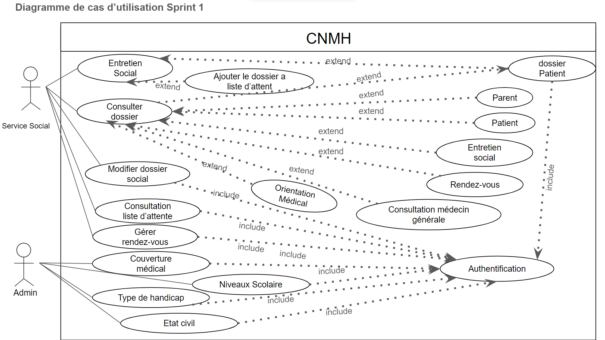
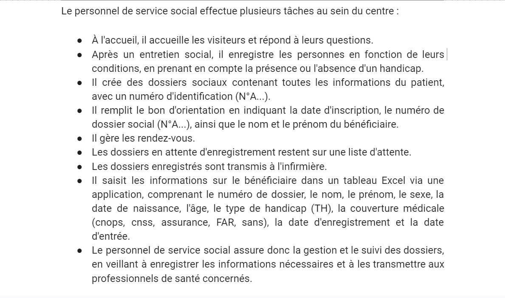
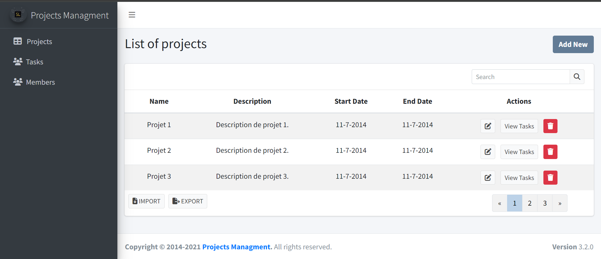
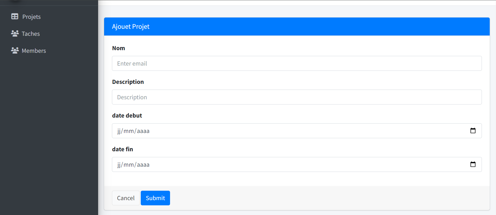

# Création de de Scénario d'entretien social
## Travail à faire
faire une scénario d'entretien social et faire une test de cette scénario sur l'application CNMH

## Critères de validation
- Scénarios
  - Rédaction de scénario en francais
  - Rédaction de scénario en UML
  - Validation des scénario dans l'application
- UI: Interfaces
  - Charte graphique (maquettage de prototype)
  - Langue
## Référence
**cas d'utilisation :**   

**l'empathie :**  

**Maquette 1:**  

**Maquette 2:**  

## Solution 
[Scénario entretien social](https://docs.google.com/presentation/d/15SIoV3ZUCIhTMoKghKYmzdA5hE7TmAl2v7EpuA40sfM/edit#slide=id.p)
